# 🏗️ System Architecture & Design Specification

This document provides a comprehensive visual and tabular breakdown of the **EcommProductRecommender** system. It details the data flow, component interaction, and database schemas.

---

## 1. 🌐 High-Level System Overview

The system follows a **Client-Server-ML** architecture. The React Native app acts as the presentation layer, communicating via REST APIs with a FastAPI backend that orchestrates database operations and real-time inference using TensorFlow.

```mermaid
graph TD
    subgraph Client [📱 Mobile Client]
        UI[React Native UI]
        Store[Zustand State Store]
        API_Client[Axios Service]
    end

    subgraph Backend [🚀 Python Server]
        FastAPI[FastAPI App]
        Executor[Async ThreadPool]
    end

    subgraph Data_Layer [💾 Data Persistence]
        SQLite[(SQLite DB)]
        FS["File System<br/>(Models & Mappings)"]
    end

    subgraph ML_Engine [🧠 AI Core]
        TF[TensorFlow / Keras]
        NCF[NCF Model]
    end

    UI --> Store
    Store --> API_Client
    API_Client -- HTTP/JSON --> FastAPI
    FastAPI -- Read/Write --> SQLite
    FastAPI -- Load/Save --> FS
    FastAPI -- Inference --> NCF
    Executor -- Training Job --> TF
    TF -- Save Model --> FS
```



---

## 2. 🧩 Component Breakdown

| Component | Technology | Responsibility |
| :--- | :--- | :--- |
| **Frontend** | React Native (Expo) | Renders UI, capturing user taps/cart actions, and displaying products. |
| **State Mgmt** | Zustand | Manages global app state (cart, user session) efficiently. |
| **API Server** | FastAPI (Python) | High-performance async server handling requests, auth, and logic. |
| **Database** | SQLite | Stores product catalog (`products`) and interactions (`user_interactions`). |
| **ML Model** | TensorFlow/Keras | Neural Collaborative Filtering (NCF) model for personalized ranking. |
| **Task Runner** | Python `concurrent.futures` | Handles long-running model retraining tasks in the background. |

---

## 3. 🔄 Data Flow: The "Smart" Recommendation Pipeline

How a user action translates into a personalized recommendation.


---

## 4. 🗄️ Database Schema

The system uses two primary tables within SQLite.

### 📦 Table: `products`
*Stores static product/catalog data.*

| Column | Type | Description |
| :--- | :--- | :--- |
| `id` | `TEXT` (PK) | Unique Product ID. |
| `name` | `TEXT` | Display name of the product. |
| `price` | `REAL` | Product price. |
| `category` | `TEXT` | Category for filtering/search. |
| `image_urls` | `TEXT` (JSON) | List of image asset URLs. |
| `tags` | `TEXT` (JSON) | Metadata tags for search matching. |

### 🖱️ Table: `user_interactions`
*Stores dynamic user behavior data for training.*

| Column | Type | Description |
| :--- | :--- | :--- |
| `id` | `INTEGER` (PK) | Auto-incrementing Log ID. |
| `user_id` | `TEXT` | ID of the user performing the action. |
| `item_id` | `TEXT` | ID of the product interacted with. |
| `type` | `TEXT` | Type of interaction (e.g., `'tap'`, `'cart'`). |
| `timestamp` | `REAL` | Unix timestamp of the event. |

---

## 5. 🔌 API Endpoints Reference

| Method | Endpoint | Purpose | Request Body / Params |
| :--- | :--- | :--- | :--- |
| `POST` | `/v1/recommendations` | **Hybrid Recs**: Get NCF ranked items, optionally filtered by search query. | `{user_id, count, search_query}` |
| `POST` | `/interactions` | **Log Action**: Save a user tap or cart add for future training. | `{user_id, item_id, type}` |
| `POST` | `/search` | **Search**: Pure DB text search (Name/Category/Tags). | `{query}` |
| `POST` | `/v1/train` | **Train**: Upload new dataset to train a fresh model instance. | `Multipart Form (file)` |
| `POST` | `/retrain` | **Retrain**: Trigger background retraining on current DB data. | *None* |

---

## 6. 🧠 Machine Learning Architecture (NCF)

The recommendation engine is a **Neural Collaborative Filtering** model consisting of two parallel pathways.

```mermaid
graph TD
    Input[Input Layer: User ID & Item ID] --> Emb_GMF[GMF Embeddings]
    Input --> Emb_MLP[MLP Embeddings]

    subgraph GMF_Path [Generalized Matrix Factorization]
        Emb_GMF --> Dot[Element-wise Product]
    end

    subgraph MLP_Path [Multi-Layer Perceptron]
        Emb_MLP --> Concat[Concatenate]
        Concat --> Dense1[Dense 64]
        Dense1 --> Dense2[Dense 32]
        Dense2 --> Dense3[Dense 16]
    end

    Dot --> Merge[Concatenate Paths]
    Dense3 --> Merge
    Merge --> Output[Sigmoid Output (Score 0-1)]
```
